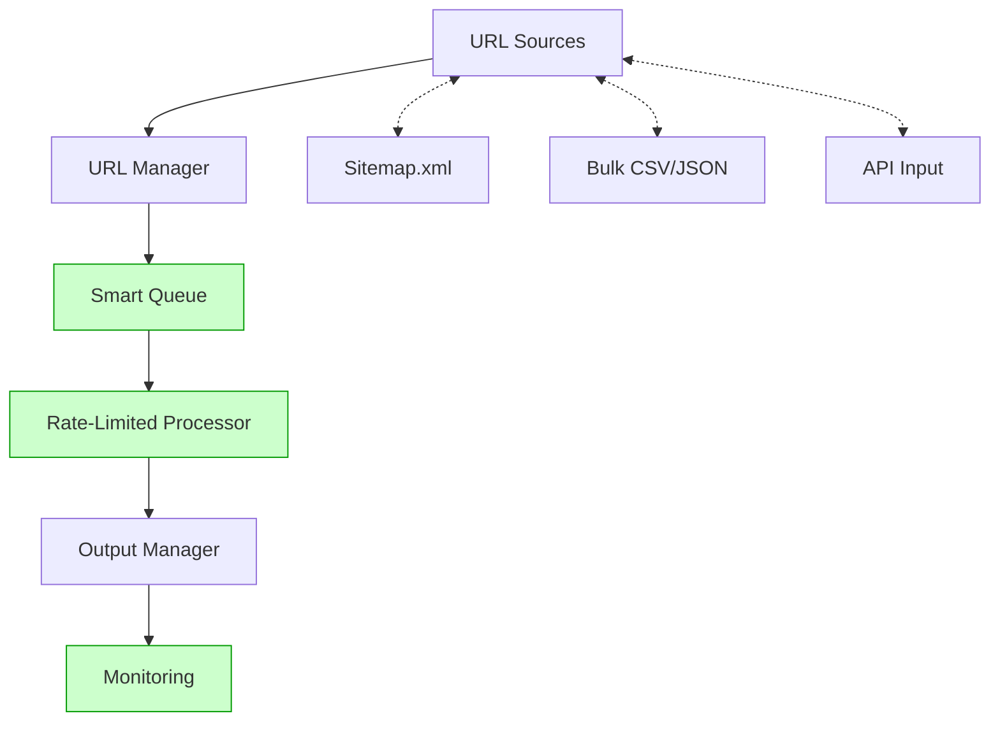

# Workflow Processing System Documentation

## Architecture Overview



## System Components

### 1. URL Sources
- **Sitemap.xml Parser**: Extracts workflow URLs from n8n.io sitemap
- **Bulk Import**: Processes CSV/JSON files with workflow IDs
- **API Input**: Allows programmatic addition of workflow URLs

### 2. URL Manager
- Handles deduplication of workflow URLs
- Maintains processing history
- Prioritizes URLs based on configured rules

### 3. Smart Queue (Existing)
- Location: `src/utils/smart_queue.py`
- Features:
  - Priority channels for different workflow types
  - Redis-backed persistence
  - Token bucket rate limiter

### 4. Rate-Limited Processor (Existing)
- Location: `src/utils/smart_queue.py`
- Features:
  - Dynamic backoff calculator based on response headers
  - Chunk processing (50 URLs per batch)
  - Jittered cooldown periods between batches

### 5. Output Manager
- Enforces directory structure:
  ```
  /root/ai_n8n_workflowmaker/n8n_workflows/
  ├── processed/  # Successfully processed workflows
  ├── errors/     # Failed processing attempts
  └── archives/   # Historical data
  ```
- Handles file naming conventions and metadata

### 6. Monitoring System (Existing)
- Location: `src/utils/system_monitor.py`
- Metrics tracked:
  - Success/failure rates
  - Processing latency
  - Queue depth
  - System resource utilization

## Task List

### ✅ Completed Components
1. **Smart Queue System**
   - Token bucket rate limiter
   - Redis-backed deduplication
   - Priority channels

2. **Rate Limiter**
   - Dynamic backoff calculator
   - Chunk processing (50 URLs/batch)

3. **Basic Monitoring**
   - Success/failure metrics
   - Processing latency tracking
   - Queue depth monitoring

### ⏳ Pending Tasks

#### Phase 1: Core Processing (Est. 2 days)
- [ ] **URL Manager Enhancements**
  - Add sitemap.xml parser to `url_manager.py`
  - Implement bulk upload endpoint
  - Create API input handler

- [ ] **Output Directory Enforcement**
  ```python
  # From planned OutputManager
  class OutputManager:
      def __init__(self, base_path="/root/ai_n8n_workflowmaker/n8n_workflows"):
          self.base = Path(base_path)
          self.base.joinpath('processed').mkdir(exist_ok=True)
          self.base.joinpath('errors').mkdir(exist_ok=True)
          self.base.joinpath('archives').mkdir(exist_ok=True)
  ```

- [ ] **Basic Dashboard Wiring**
  - Connect existing metrics to dashboard
  - Create simple visualization

#### Phase 2: Scaling (Est. 1 day)
- [ ] **Auto-scaling Workers**
  - Implement worker pool manager
  - Add concurrency controls

- [ ] **Jittered Cooldown System**
  ```python
  def get_cooldown(base=300):
      return base + random.randint(0, 600)  # 5-15 minute jitter
  ```

#### Phase 3: Observability (Est. 1 day)
- [ ] **Alert Rule Configuration**
  - Error rate > 15%
  - Queue latency > 1hr
  - System memory > 90%

- [ ] **Historical Metrics Storage**
  - Implement time-series database connector
  - Create retention policies

## Implementation Details

### URL Manager Implementation

```python
class URLManager:
    def __init__(self, redis_client):
        self.redis = redis_client
        self.processed_set = "processed_urls"
        
    async def parse_sitemap(self, sitemap_url="https://n8n.io/sitemap-workflows.xml"):
        """Parse sitemap.xml and extract workflow URLs from 'loc' parameter"""
        # Implementation example:
        # async with aiohttp.ClientSession() as session:
        #     async with session.get(sitemap_url) as response:
        #         if response.status == 200:
        #             content = await response.text()
        #             soup = BeautifulSoup(content, 'xml')
        #             urls = [loc.text for loc in soup.find_all('loc')]
        #             return urls
        #         else:
        #             raise Exception(f"Failed to fetch sitemap: {response.status}")
        
    async def add_bulk_urls(self, file_path):
        """Process CSV/JSON file with workflow IDs"""
        # Implementation details
        
    async def is_processed(self, url):
        """Check if URL has been processed"""
        return await self.redis.sismember(self.processed_set, url)
        
    async def mark_processed(self, url):
        """Mark URL as processed"""
        await self.redis.sadd(self.processed_set, url)
```

### Output Manager Implementation

```python
from pathlib import Path
import json
import shutil

class OutputManager:
    def __init__(self, base_path="/root/ai_n8n_workflowmaker/n8n_workflows"):
        self.base = Path(base_path)
        self.processed_dir = self.base / "processed"
        self.errors_dir = self.base / "errors"
        self.archives_dir = self.base / "archives"
        
        # Create directories if they don't exist
        self.processed_dir.mkdir(exist_ok=True, parents=True)
        self.errors_dir.mkdir(exist_ok=True, parents=True)
        self.archives_dir.mkdir(exist_ok=True, parents=True)
        
    def save_workflow(self, workflow_id, workflow_data, analysis_data):
        """Save workflow and analysis to the processed directory"""
        workflow_dir = self.processed_dir / workflow_id
        workflow_dir.mkdir(exist_ok=True)
        
        # Save workflow JSON
        with open(workflow_dir / f"{workflow_id}.json", "w") as f:
            json.dump(workflow_data, f, indent=2)
            
        # Save README.md with analysis
        with open(workflow_dir / "README.md", "w") as f:
            f.write(analysis_data)
            
        return workflow_dir
        
    def save_error(self, workflow_id, error_data):
        """Save error information"""
        error_file = self.errors_dir / f"{workflow_id}_error.json"
        with open(error_file, "w") as f:
            json.dump(error_data, f, indent=2)
            
        return error_file
        
    def archive_workflow(self, workflow_id):
        """Move workflow to archives"""
        src_dir = self.processed_dir / workflow_id
        dst_dir = self.archives_dir / workflow_id
        
        if src_dir.exists():
            shutil.move(str(src_dir), str(dst_dir))
            return dst_dir
            
        return None
```

## Monitoring Integration

```python
class WorkflowMonitor:
    def __init__(self):
        self.metrics = {
            "success_count": 0,
            "error_count": 0,
            "processing_times": [],
            "queue_depth": 0
        }
        
    def record_success(self, processing_time):
        """Record successful workflow processing"""
        self.metrics["success_count"] += 1
        self.metrics["processing_times"].append(processing_time)
        
    def record_error(self, error_type):
        """Record workflow processing error"""
        self.metrics["error_count"] += 1
        
    def update_queue_depth(self, depth):
        """Update queue depth metric"""
        self.metrics["queue_depth"] = depth
        
    def get_error_rate(self):
        """Calculate error rate"""
        total = self.metrics["success_count"] + self.metrics["error_count"]
        if total == 0:
            return 0
        return self.metrics["error_count"] / total
        
    def get_avg_processing_time(self):
        """Calculate average processing time"""
        if not self.metrics["processing_times"]:
            return 0
        return sum(self.metrics["processing_times"]) / len(self.metrics["processing_times"])
        
    def should_alert(self):
        """Check if alerts should be triggered"""
        return (
            self.get_error_rate() > 0.15 or
            self.get_avg_processing_time() > 3600 or
            self.metrics["queue_depth"] > 1000
        )
```

## Next Steps

1. Implement the URL Manager with sitemap.xml parsing
2. Create the Output Manager for directory structure enforcement
3. Integrate the monitoring system with alerts
4. Implement the jittered cooldown system
5. Add auto-scaling worker pool
