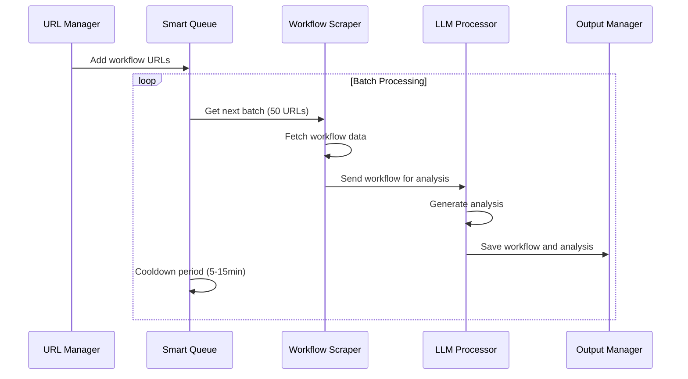

# Technology Stack

## Core Technologies

### Programming Languages
- **Python 3.9+**: Primary language for all components
- **Markdown**: Used for templates and documentation

### Frameworks and Libraries
- **aiohttp**: Asynchronous HTTP client/server for API requests
- **asyncio**: Asynchronous I/O, event loop, and coroutines
- **redis**: Redis client for caching and queue management
- **beautifulsoup4**: HTML parsing for sitemap and workflow extraction
- **pathlib**: Object-oriented filesystem paths
- **json**: JSON parsing and serialization

### APIs and Services
- **OpenRouter API**: Gateway to LLM models
- **Mistral AI**: Primary LLM model for workflow analysis
- **n8n.io**: Source of workflow data

## Architecture Decisions

### 1. Asynchronous Processing
- **Decision**: Use asyncio for all I/O operations
- **Rationale**: 
  - Enables concurrent processing of multiple workflows
  - Improves throughput for I/O-bound operations
  - Better utilization of system resources
- **Implementation**: 
  - Async HTTP client for API requests
  - Async Redis client for queue operations
  - Task pools for controlled concurrency

### 2. Template-Based Analysis
- **Decision**: Use Markdown templates for LLM prompts
- **Rationale**:
  - Separates prompt engineering from code
  - Enables easy modification and versioning of prompts
  - Supports different analysis types (technical, business)
- **Implementation**:
  - Template loading with fallback options
  - Simple variable substitution
  - Support for different template types

### 3. Rate Limiting and Cooling
- **Decision**: Implement token bucket rate limiter with jittered cooldown
- **Rationale**:
  - Prevents API rate limit errors
  - Distributes requests over time
  - Adapts to API response headers
- **Implementation**:
  - Token bucket algorithm for rate limiting
  - Jittered cooldown periods between batches
  - Dynamic backoff based on response headers

### 4. Output Management
- **Decision**: Structured directory layout with consistent naming
- **Rationale**:
  - Organizes outputs for easy access
  - Separates successful and failed processing
  - Maintains historical data
- **Implementation**:
  - Directory structure enforcement
  - Consistent file naming conventions
  - Error handling and logging

### 5. Monitoring and Alerting
- **Decision**: Simple metrics tracking with alert thresholds
- **Rationale**:
  - Provides visibility into system health
  - Enables early detection of issues
  - Supports capacity planning
- **Implementation**:
  - Success/failure rate tracking
  - Processing latency monitoring
  - Queue depth tracking
  - Alert thresholds for key metrics

## Model Selection

### Primary Model
- **Model**: `mistralai/ministral-8b`
- **Rationale**:
  - Good balance of quality and cost
  - Sufficient context window for workflow analysis
  - Fast response time for batch processing
- **Configuration**:
  - Temperature: 0.7
  - Max tokens: 4096
  - Top-p: 0.9

### Fallback Model
- **Model**: `mistralai/mistral-small`
- **Rationale**:
  - Lower cost for simpler workflows
  - Faster response time
  - Sufficient for basic analysis
- **Configuration**:
  - Temperature: 0.7
  - Max tokens: 2048
  - Top-p: 0.9

## Data Flow

## Deployment Considerations

### Resource Requirements
- **CPU**: 4+ cores recommended
- **Memory**: 8GB+ recommended
- **Disk**: 50GB+ for workflow data and analysis
- **Network**: Reliable internet connection

### Dependencies
- Python 3.9+
- Redis server
- OpenRouter API key
- Access to n8n.io sitemap

### Configuration
- Environment variables for API keys
- Configuration file for system parameters
- Template directory for analysis templates
